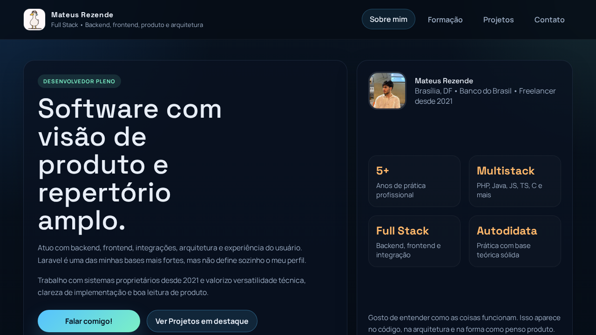
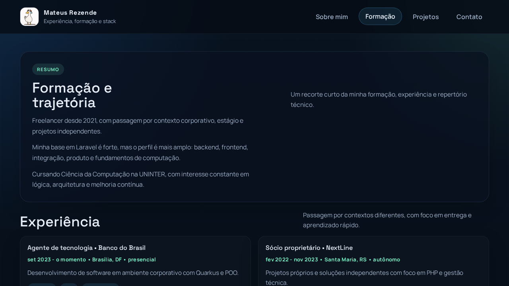
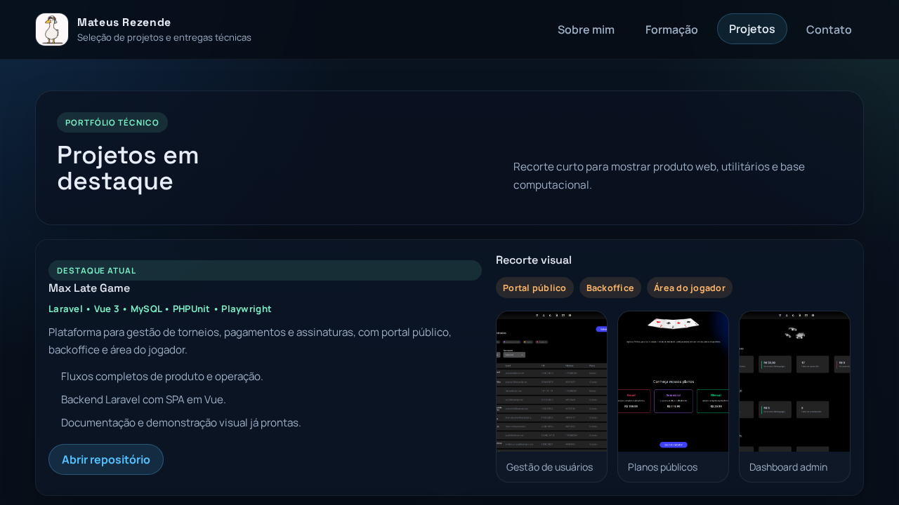
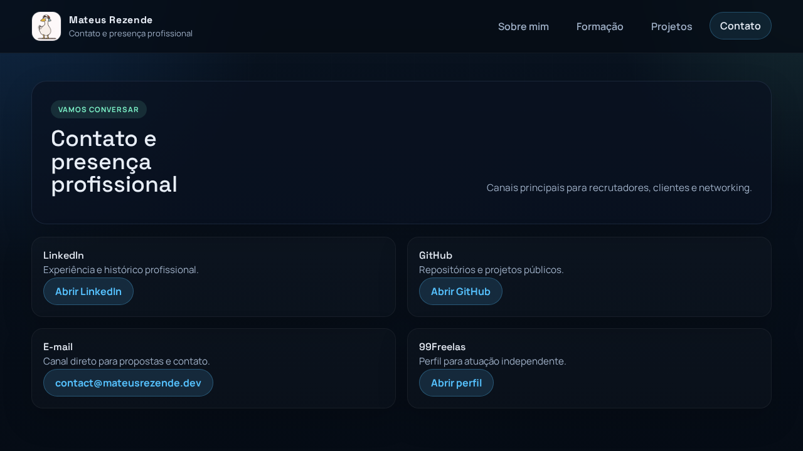
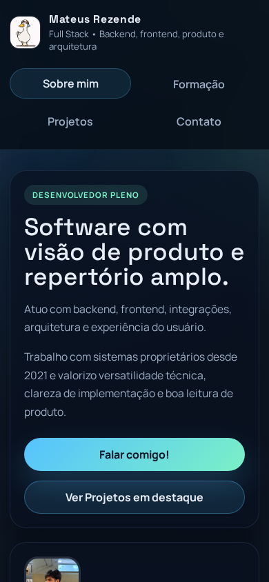

# mmrezende.github.io

Portfólio pessoal em HTML e CSS com foco em leitura rápida, visual limpo e apresentação multidisciplinar.

## Estrutura

- Sobre mim
- Formação
- Projetos
- Contato

## Destaque

`Max Late Game` aparece como projeto principal, com link direto para o repositório e recortes visuais em maior destaque.

- Repositório: https://github.com/mmrezende/auten-max-late-game

## Capturas do portfólio

## Max Late Game

